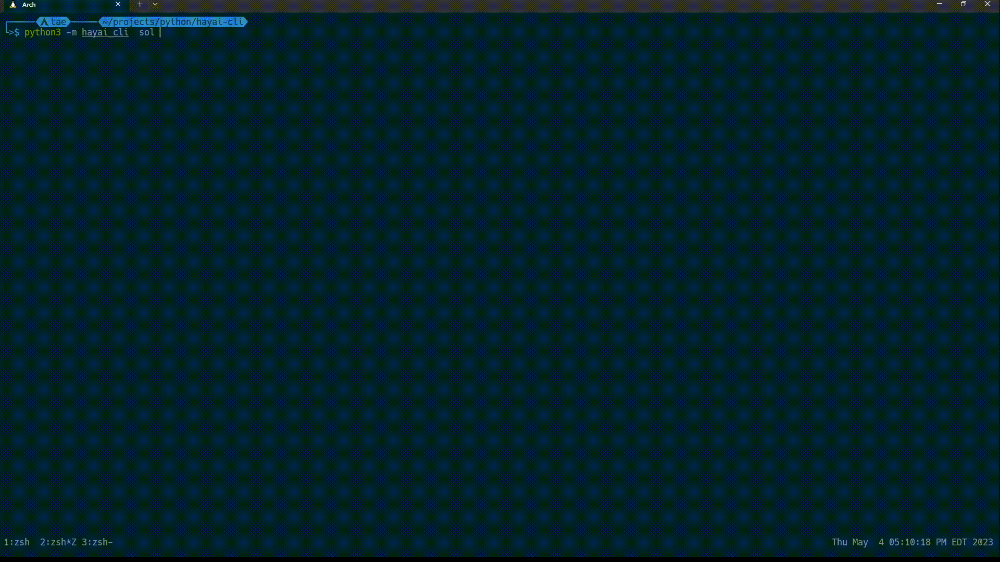

<a name="readme-top"></a>
<!-- PROJECT LOGO -->
<br />
<div align="center">

  <h3 align="center">HAYAI-CLI</h3>

  <p align="center">
    An awesome Application to download/play movies or shows !
    <br />
    <a href="#demo">View Demo</a>
    ·
    <a href="https://github.com/crypto-0/hayai-cli/issues">Report Bug</a>
    ·
    <a href="https://github.com/crypto-0/hayai-cli/pulls">Request Feature</a>
  </p>
</div>


<!-- TABLE OF CONTENTS -->
<details>
  <summary>Table of Contents</summary>
  <ol>
    <li>
      <a href="#about-the-project">About The Project</a>
    </li>
    <li>
      <a href="#getting-started">Getting Started</a>
      <ul>
        <li><a href="#prerequisites">Prerequisites</a></li>
        <li><a href="#installation">Installation</a></li>
      </ul>
    </li>
    <li><a href="#usage">Usage</a></li>
    <li><a href="#demo">Demo</a></li>
    <li><a href="#license">License</a></li>
  </ol>
</details>


<!-- ABOUT THE PROJECT -->
## About The Project

This is movies or tv show stream/downloader Application that will scrape streaming services like solarmovie.pe 

<p align="right">(<a href="#readme-top">back to top</a>)</p>


<!-- GETTING STARTED -->
## Getting Started

### Prerequisites

* python3
* pip

### Installation
```sh
$ git clone https://github.com/crypto-0/hayai-cli.git
$ cd hayai-cli
$ pip install .
```
<p align="right">(<a href="#readme-top">back to top</a>)</p>

<!-- USAGE EXAMPLES -->
## Usage
```sh
Usage: python -m hayai_cli sol [OPTIONS] COMMAND [ARGS]...

  solarmovie provider

Options:
  --help  Show this message and exit.

Commands:
  movies    Show movies
  search    search for movies or shows
  shows     Show shows
  top imdb  Show top imbd movies or shows
```
### provider category commands
Each provider has specific categories that can be query such search, showing the latest shows or movies, what is trending, etc
* The **category** commands will send a query for  movies or tv shows and allow you to browse what they have to offer
### h / --help argument
This argument is used to get help if lost or don't know what to do and will exist the application after

### -m / --mode
This argument is used by all category to specifie if to play or download

### -p / --page
This argument is used by all category except home to get the specific page such page 5 of trending category

### -q / --quality
This argument is used by all category to get the specified quality of a stream

### -d / --dir
This argument is used by all category to specifie which directory to download 
<p align="right">(<a href="#readme-top">back to top</a>)</p>

## Demo

<p align="right">(<a href="#readme-top">back to top</a>)</p>

<!-- LICENSE -->
## License

Distributed under the MIT License.

<p align="right">(<a href="#readme-top">back to top</a>)</p>


